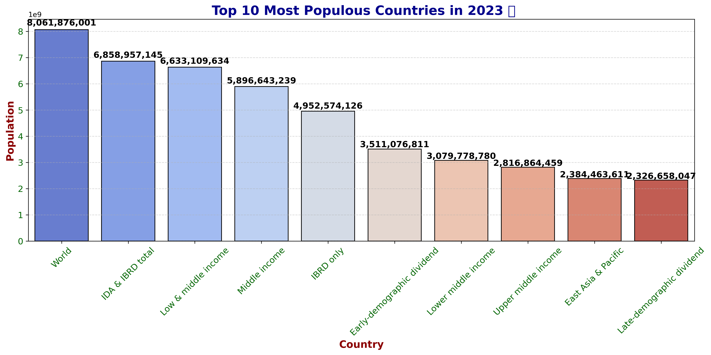

# PRODIGY_DS_01
Population-Visualization : A bar chart visualization of the world's top 10 most populous countries using Python
# 🌍 Population Visualization 📊

This project visualizes the **Top 10 Most Populous Countries** using data from the **World Bank**. It generates a **bar chart** using `matplotlib` and `seaborn`.

## 📌 Features
✅ Fetches real-world population data  
✅ Filters and processes the latest available year  
✅ Creates a **bar chart** with **clear labels & styling**  
✅ Saves the dataset as CSV and visualization as PNG  

## 🔧 Installation & Usage
1. **Clone the repository**
   ```
   git clone https://github.com/YOUR-USERNAME/Population-Visualization.git
   cd Population-Visualization
2. Install dependencies
   ```
   pip install -r requirements.txt

3.  Run the script
    ```
    python population_distribution.pny

📊 Example Visualization
Once you run the script, it will generate a bar chart like this:



📁 Dataset Source
World Bank Population Data
[🔗World Bank Population Data](https://data.worldbank.org/indicator/SP.POP.TOTL)
---

